<strong>
    <h2 align="center">NeuMusic    
    </br>
    
    </h2>
</strong>
<p align="center">
    一个新拟态风格的第三方网易云音乐播放器
</p>

## 特性

- 原生html + javascript/jQuery + css 开发
- 纯静态网页
- 支持网易云账号(手机/邮箱)登录
- 新拟态风格

## 软件截图

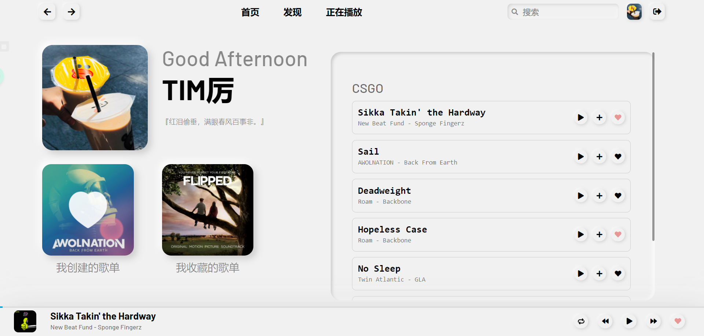

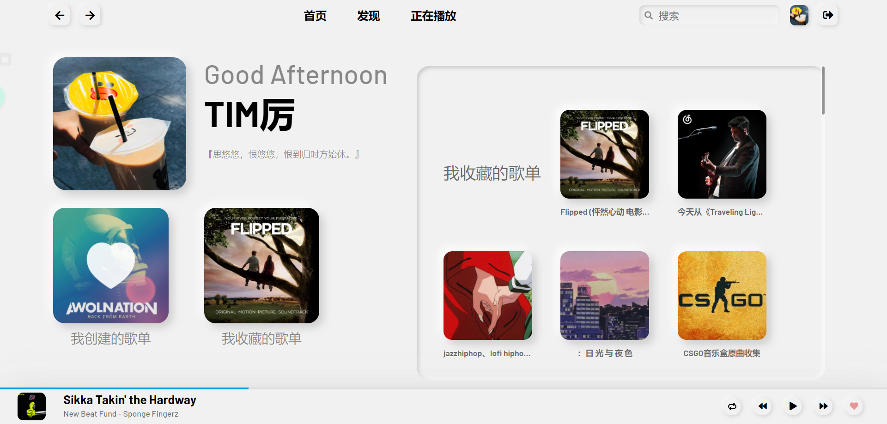


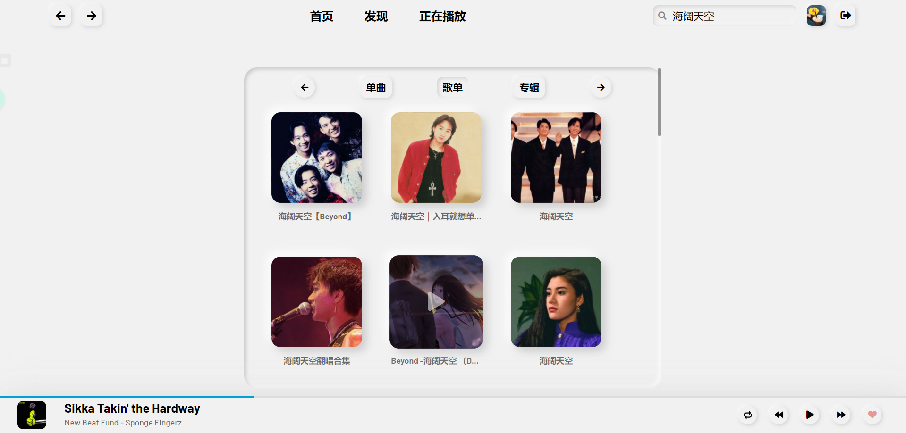

## 部署

1. 克隆代码到本地

   ```sh
   git clone https://github.com/timlzh/NeuMusic.git
   ```
   国内可用镜像站`git clone https://hub.fastgit.org/timlzh/NeuMusic.git`访问更快
   
2. 部署[Binaryify/NeteaseCloudMusicApi](https://github.com/Binaryify/NeteaseCloudMusicApi)

   部署网易云 API，详情参见 [Binaryify/NeteaseCloudMusicApi](https://github.com/Binaryify/NeteaseCloudMusicApi)

3. 部署网页

   - Windows

     在Windows环境下，最好的解决方案是使用Windows自带的`IIS(Internet Information Services)`来将网页部署到本地。

     1. [控制面板] --[程序] -- [启用或关闭Windows功能]

        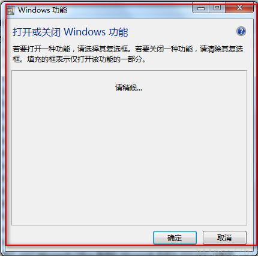

     2. 按照下图所示，勾上对应的选项框，打开万维网服务的加号，也是需要全部勾选的。选择完成后点击确定按钮。

        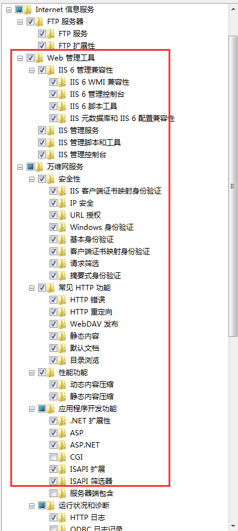

     3. 在“开始”菜单的搜索框里搜索“IIS”，打开IIS

        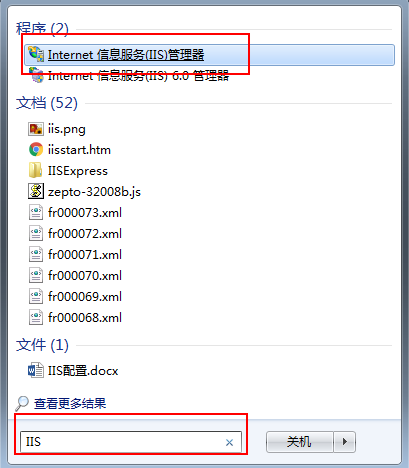

     4. 在右侧的连接中选择你的的电脑，右键[网站]，选择[添加网站]。

        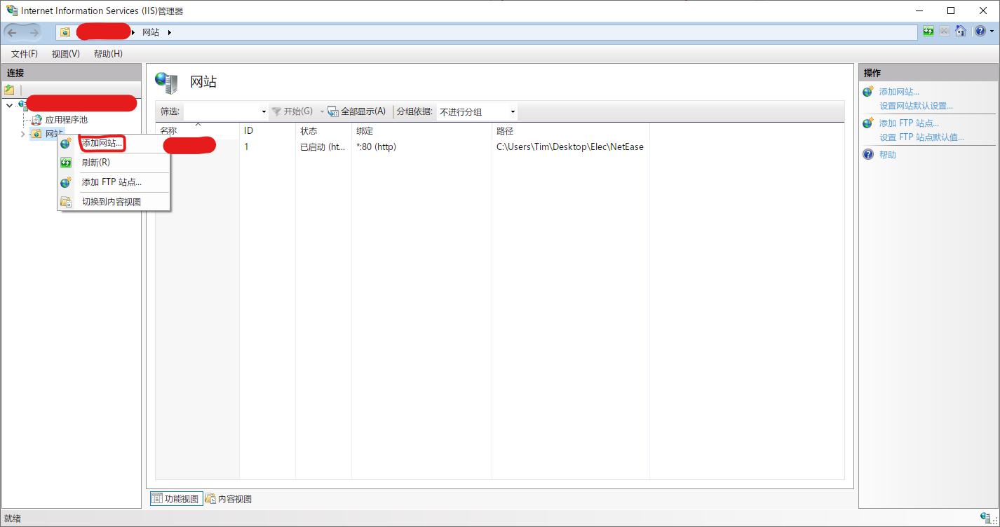

     5. 在弹出的窗口中填入信息

        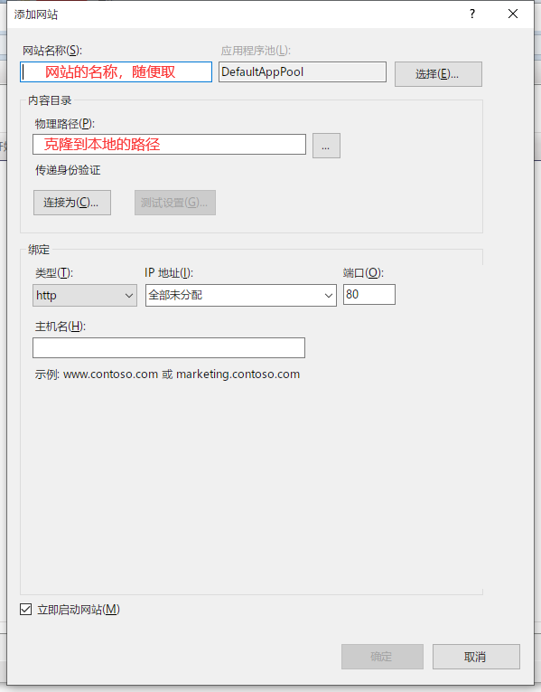

     6. 可以看到我们的测试网站已经成功添加，现在来设置一下基本参数。点击应用程序池，选中我们网站对应的应用池，右键选择高级设置。

        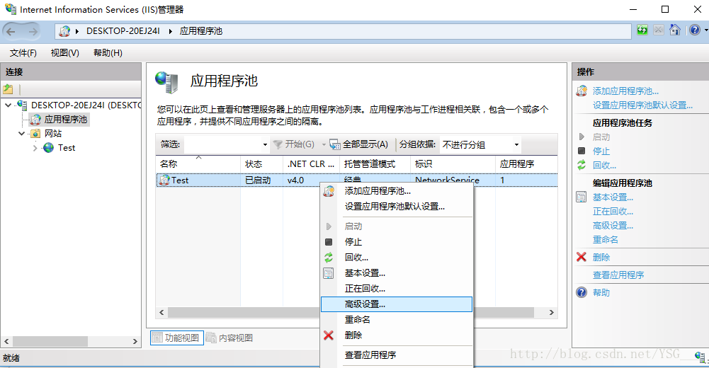

     7. 设置管道托管模式为Classic，标识为NetworkService

        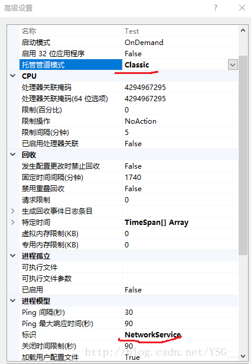

     8. 完成上面步骤后，还需要配置网站的访问权限。回到Test网站中，选择编辑权限，弹出网站属性窗口，选择安全选项，点击编辑。

        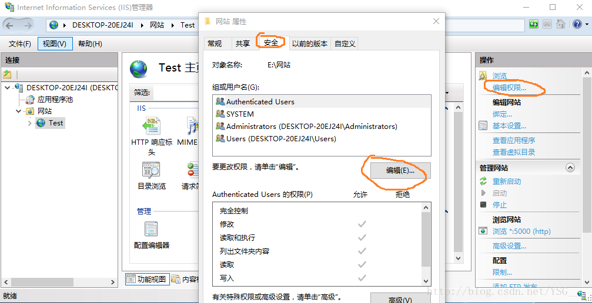

     9. 弹出网站的权限，点击添加。输入对象名everyone后点击检查名称，然后确定。

        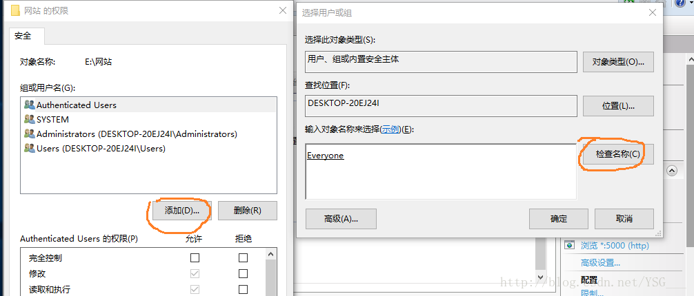

        最后，在网页中打开http://localhost，就能愉快地使用NeuMusic啦！

        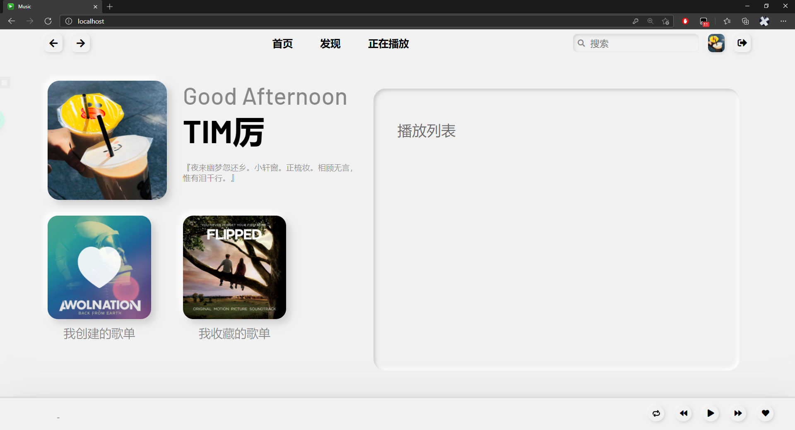

        （教程参考于[windows IIS Web服务器 发布网站](https://blog.csdn.net/lijie45655/article/details/95301916)）

   - Linux服务器

     请使用Apache服务或Nginx服务部署。

4. 在网页中输入api地址，一定不要忘了地址最后的/
   
   如: `http://127.0.0.1:3000/`
   
   如果你是在本地部署的api，则api地址为`"http://localhost:3000/"`

## 贡献者

@[Timlzh](https://github.com/timlzh/)

## 鸣谢

[qier222/YesPlayMusic](https://github.com/qier222/YesPlayMusic)

[Binaryify/NeteaseCloudMusicApi](https://github.com/Binaryify/NeteaseCloudMusicApi)


